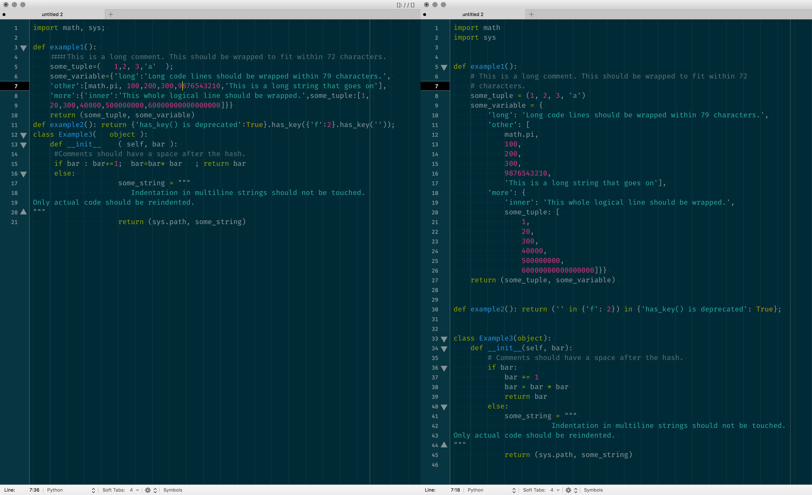
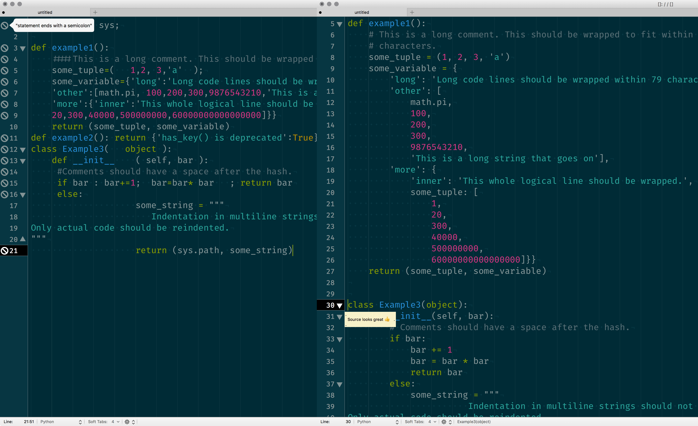

# Python Pep8er bundle for TextMate

If you are a Python developer, this bundle will become really handy! When you
save your source code via <kbd>⌃</kbd> + <kbd>⇧</kbd> + <kbd>S</kbd> in Python
or Django scope, this bundle will run [autopep8][01] checker first, then
[flake8][02] against checker against your current document.

Before and after **autopep8**:


Before and after **flake8**:



## Installation

You need to install `autopep8` and `flake8` Python modules according to your
Python environment. Example:

```bash
pip install autopep8 flake8 # good for Homebrew Python installation.
```

You can add custom TextMate variables from **TextMate > Preferences > Variables**

    TM_PEP8ER_AUTOPEP8 | /Users/vigo/.pyenv/shims/autopep8  # If you like to use pyenv
    TM_PEP8ER_FLAKE8   | /Users/vigo/.pyenv/shims/flake8

I recommend you to install these modules to different location rather than Homebrew’s
or pyenv’s defaults:

```bash
sudo /usr/bin/easy_install --script-dir=/usr/bin/ flake8
sudo /usr/bin/easy_install --script-dir=/usr/bin/ autopep8

# Now you you don’t need to set anything from TextMate variables.
```

When you finish required Python module installation, clone the repo:

```bash
cd "~/Library/Application Support/TextMate/Bundles/"
git clone https://github.com/vigo/textmate2-python-pep8er.git
# restart your TextMate
```

Now It’s your turn to shine your Python code via kicking the keys!


---

## Keyboard Shortcuts

Key Combination | Function
----------------|----------------
<kbd>kntrl (⌃)</kbd> + <kbd>shift (⇧)</kbd> + <kbd>S</kbd> | Runs autopep8 and flake8 in-order.
<kbd>kntrl (⌃)</kbd> + <kbd>S</kbd> | Let’s you run autopep8 or flake8 individually. 

---

## TextMate Variables

### `TM_PEP8ER_CUSTOM_MAX_CHARS`

By default, maximum character limit is: `79`. You can change it via using
`TM_PEP8ER_CUSTOM_MAX_CHARS` TextMate variable.

### `TM_PEP8ER_DJANGO_MAX_CHARS`

Django allows `119` characters. If your scope is `source.django` and you would
like to check against 119 chars (*or what number you’d like to*), you need to 
set `TM_PEP8ER_DJANGO_MAX_CHARS`.

### `TM_PEP8ER_AUTOPEP8` and `TM_PEP8ER_FLAKE8`

Executable binary locations will be used from these variables if they are set.

### `TM_PEP8ER_AUTOPEP8_EXTRA_OPTIONS` and `TM_PEP8ER_AUTOPEP8_CUSTOM_OPTIONS`

By default, `autopep8` arguments are:

```bash
autopep8 --in-place --aggressive --aggressive --max-line-length 79 # or what number you set via TM variable
```

You can add more parameters via `TM_PEP8ER_AUTOPEP8_EXTRA_OPTIONS` variable.
If you set, values will be appended to default parameters.

If you like to run your own (*this will override defaults*) just use:
`TM_PEP8ER_AUTOPEP8_CUSTOM_OPTIONS` variable. Example:

    TM_PEP8ER_AUTOPEP8_CUSTOM_OPTIONS | --max-line-length 79 --line-range 20 40

### `TM_PEP8ER_FLAKE8_EXTRA_OPTIONS` and `TM_PEP8ER_FLAKE8_CUSTOM_OPTIONS`

Same as previous variable. `TM_PEP8ER_FLAKE8_EXTRA_OPTIONS` will be appended to
default parameters of `flake8`. Custom options will override defaults via
`TM_PEP8ER_FLAKE8_CUSTOM_OPTIONS` variable. (*Not recommended*)


---


## Contributer(s)

* [Uğur "vigo" Özyılmazel](https://github.com/vigo) - Creator, maintainer


---


## Contribute

All PR’s are welcome!

1. `fork` (https://github.com/vigo/textmate2-python-pep8er/fork)
1. Create your `branch` (`git checkout -b my-features`)
1. `commit` yours (`git commit -am 'added killer options'`)
1. `push` your `branch` (`git push origin my-features`)
1. Than create a new **Pull Request**!


---


## License

This project is licensed under MIT


---


## Change Log

**2017-05-14**

* Updated: Success tooltip message now shows maximum characters value
* Updated: Screenshot of `before-and-after-flake8.png`
* Changed: Overriding default save keys (<kbd>⌘</kbd> + <kbd>S</kbd>) was a bad idea :)

**2017-05-13**

* First release :)

**2017-05-06**

* Initial commit

[01]: https://pypi.python.org/pypi/autopep8 "autopep8 PEP8 checker"
[02]: https://pypi.python.org/pypi/flake8 "flake8 source code checker"